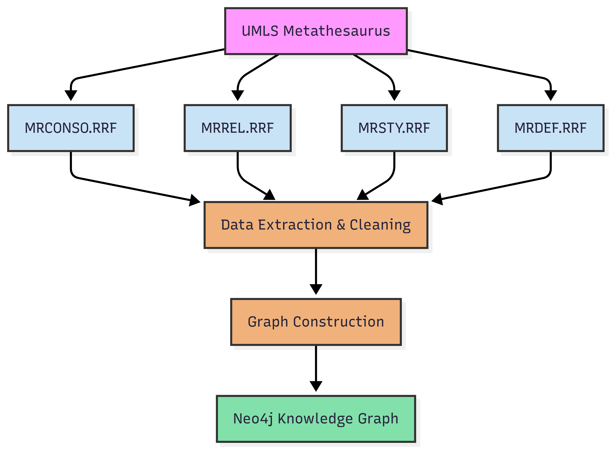

# UMLS-knowledge-graph  
🧬 **Biomedical UMLS Knowledge Graph Pipeline**

This repository contains the complete implementation of a **biomedical knowledge graph construction pipeline** leveraging the **Unified Medical Language System (UMLS)**.  
It extracts **concepts**, **relationships**, **synonyms**, **semantic types**, and **definitions** from UMLS sources, processes the data, and loads it into a **Neo4j graph database**.
#  🚀 Get Started
1️⃣ Clone the Repository
```sh
git clone https://github.com/jaaferklila/UMLS_knowledge_graph.git
```
```sh
cd UMLS_knowledge_graph
```
# 📥 Download and Import the Graph
1️⃣ Install gdown (to download from Google Drive):
```sh
   pip install gdown
```
2️⃣ Go to the graph folder:
```sh
cd graph
```

3️⃣ Make the script executable:
```sh
chmod +x graph.sh
```

4️⃣ Run the script to download the graph:
```sh
./graph.sh
```

This will download a file called graph.zip into the graph folder.

5️⃣ Unzip the file:
```sh
unzip graph.zip
```
you will get a file named neo4j.dump (the graph database)

6️⃣ download Neo4j Desktop (Version 1.6.2) 

[Neo4j Desktop](https://neo4j.com/deployment-center/?desktop-gdb)

7️⃣ Move the dump file (for example graph.dump) into the import folder of your Neo4j installation.
8️⃣ Load the dump into your database with the following command:
```sh
bin/neo4j-admin database load neo4j --from-path=import --overwrite-destination=true
```
⚠️ Replace neo4j with the name of your database if you’re not using the default one.

👉 After this, you can start your database from Neo4j Desktop and explore your graph 🚀


Video Tutorial
[](import_UMLS_neo4j.mp4)


******************************************************************************
******************************************************************************
*****************************************************************************
<div align="center">
✨ <h4>Quick Overview of the Graph Construction</h4>
</div>
## ✨ Features

- 📄 **UMLS Metathesaurus parsing** — MRCONSO, MRREL, MRSTY, MRDEF  
- 🏷 **Concept enrichment** — names, synonyms, definitions, semantic types  
- 🗂 **Graph construction** in Neo4j  
- 🤖 **LLM-ready integration** for reasoning and retrieval  

---

## 📥 Getting UMLS Data

To use this pipeline, you first need to obtain the Unified Medical Language System (UMLS). Please note that UMLS data is **licensed** and requires a valid license agreement to download.

### License and Download

- You must have a **UMLS license** to download the data.  
- Register and download the latest UMLS release from the official site:  
  [https://uts.nlm.nih.gov/license.html](https://uts.nlm.nih.gov/license.html)

### Available Files

The pipeline uses the following UMLS Metathesaurus files:

- `MRCONSO.RRF` — Concept names, preferred terms, and synonyms.  
- `MRREL.RRF` — Relationships between concepts (e.g., broader, narrower, related-to).  
- `MRSTY.RRF` — Semantic types associated with each concept.  
- `MRDEF.RRF` — Definitions for concepts.  

Learn more: [Metathesaurus Data Files Documentation](https://www.nlm.nih.gov/research/umls/new_users/online_learning/Meta_006.html)


## 🛠 Graph Construction Pipeline

The graph construction follows the pipeline illustrated in the figure below:



## 🗄 Loading UMLS Data into MySQL

This section describes how to load the UMLS data files into a MySQL database for analysis.

###  Install MySQL
You will need  MySQL Workbench.  
Download it here: [https://www.mysql.com/products/workbench/](https://www.mysql.com/products/workbench/)

---
Creating a Database
CREATE DATABASE IF NOT EXISTS umls CHARACTER SET utf8 COLLATE utf8_unicode_ci;
## ⚙️ Configuring MySQL for UMLS Performance

Before loading the UMLS `.RRF` files into MySQL, it’s recommended to adjust MySQL settings for better performance.

### Edit MySQL Configuration

1. Open your MySQL configuration file:
- **Linux:**
```sh
sudo nano /etc/mysql/mysql.conf.d/mysqld.cnf
 ```
2. Under the [mysqld] section, add the following parameters:

```sh
[mysqld]
# Performance tuning for UMLS
key_buffer_size           = 600M
table_open_cache          = 300
sort_buffer_size          = 500M
read_buffer_size          = 200M
query_cache_limit         = 3M
query_cache_size          = 100M
myisam_sort_buffer_size   = 200M
bulk_insert_buffer_size   = 100M
join_buffer_size          = 100M

# Allow LOAD DATA LOCAL INFILE
local_infile              = 1
```

3. Restart MySQL
 ```sh
sudo systemctl restart mysql 
```


4. go to mysql and add  :
```sh 
SET GLOBAL local_infile = 1;
```
```sh
exit;
```


### Data extraction & cleaning
1. CREATE DATABASE
 ```sh  
CREATE DATABASE IF NOT EXISTS umls CHARACTER SET utf8 COLLATE utf8_unicode_ci;
```
6. Run Data Import Script

Before running the script, you may want to adjust `populate_mysql_db.sh` to include only the tables you want to create and load.

Then, make the script executable and run it:

```sh
chmod 775 populate_mysql_db.sh
./populate_mysql_db.sh
```
For more information, see the official UMLS documentation:  
 https://www.nlm.nih.gov/research/umls/implementation_resources/scripts/README_RRF_MySQL_Output_Stream.html
> After loading, you will have 4 main tables (`MRCONSO`, `MRREL`, `MRSTY`, and `MRDEF`) containing the UMLS data in your MySQL database.

## 🔍 Exploring and Analyzing UMLS Data

Once the UMLS `.RRF` files are loaded into MySQL, you will have several core tables that represent different aspects of the biomedical knowledge graph. The most important tables are:

| Table   | Description                                         |
|---------|---------------------------------------------------|
| MRCONSO | Contains concept names, synonyms, and identifiers |
| MRREL   | Stores relationships (edges) between concepts     |
| MRSTY   | Maps concepts to semantic types (categories)      |
| MRDEF   | Contains definitions and descriptions of concepts |

### 🧹 Data Cleaning & Enrichment
After importing the UMLS `.RRF` data into MySQL, we perform a **data cleaning and enrichment** step to prepare it for **graph construction**.  

#### 📌 Steps Performed

1. **Join Core UMLS Tables**  
   Associate each `CUI` with:  
   - ✅ Preferred name (`MRCONSO`)  
   - ✅ Synonyms (`MRCONSO`)  
   - ✅ Definition (`MRDEF`)  
   - ✅ Semantic types (`MRSTY`)  
   - ✅ Relationships (`MRREL`)  

2. **Filter & Normalize**  
   - 🌐 Keep only **English terms** (`LAT='ENG'`)  
   - 🗑 Remove **duplicates** and **null values**  
   - 🔖 filter by **vocabulary source** (`SAB`)  

3. **Aggregate Results**  
   - 🧩 Combine all information into **one enriched table**  
   - 📝 Format **synonyms**, **semantic types**, and **relationships** as concatenated strings for easy export  

### 🗂 Enriched UMLS Relationships File

After the **data cleaning and enrichment** step, we generate a CSV file containing the enriched relationships between UMLS concepts.  

#### 📄 Columns in the File
The CSV file `MRREL_with_STR_STY_defs_synonyms_clean.csv` contains the following columns:

| Column | Description |
|--------|-------------|
| CUI1 | Concept Unique Identifier 1 |
| AUI1 | Atom Unique Identifier 1 |
| CUI2 | Concept Unique Identifier 2 |
| AUI2 | Atom Unique Identifier 2 |
| RUI | Relationship Unique Identifier |
| relation | Human-readable relation |
| STR1 | Concept 1 string |
| STR2 | Concept 2 string |
| CUI1_semtypes | Semantic types of CUI1 (concatenated) |
| CUI2_semtypes | Semantic types of CUI2 (concatenated) |
| Definitions1 | Definitions for CUI1 |
| Definitions2 | Definitions for CUI2 |
| Synonyms1 | Synonyms for CUI1 |
| Synonyms2 | Synonyms for CUI2 |

#### 📝 Example Row
```csv
CUI1,AUI1,CUI2,AUI2,RUI,relation,STR1,STR2,CUI1_semtypes,CUI2_semtypes,Definitions1,Definitions2,Synonyms1,Synonyms2
C0000005,A26634265,C0036775,A0115649,R31979041,has_broader_relationship,(131)I-Macroaggregated Albumin,"Serum Albumin, Radio-Iodinated","Amino Acid, Peptide, or Protein || Pharmacologic Substance || Indicator, Reagent, or Diagnostic Aid","Amino Acid, Peptide, or Protein || Indicator, Reagent, or Diagnostic Aid","Definition from MSH: Normal human serum albumin mildly iodinated with radioactive iodine (131-I) which has a half-life of 8 days, and emits beta and gamma rays. It is used as a diagnostic aid in blood volume determination. (from Merck Index, 11th ed)",, "(131)I-MAA","Serum Albumin, Radio Iodinated | Albumin, Radio-Iodinated Serum | Radio-Iodinated Serum Albumin | Serum Albumin, Radioiodinated | Albumin, Radioiodinated Serum | Radioiodinated Serum Albumin | RISA"

